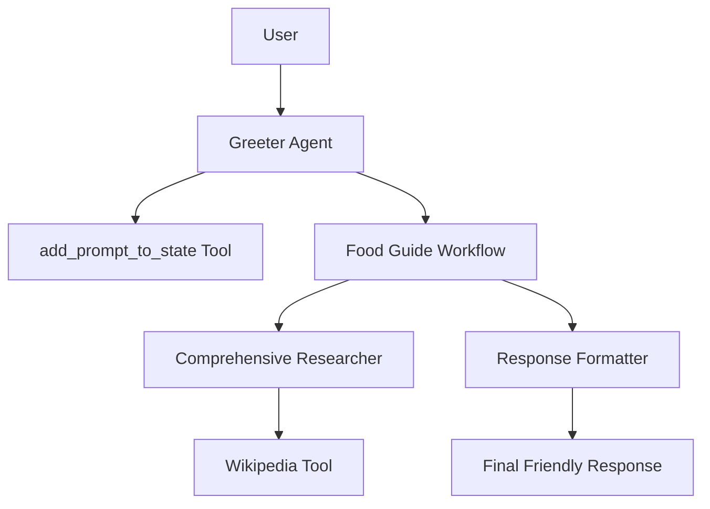

# System Design - Food Explorer Agent

## Overview
The Food Explorer Agent is an enterprise-grade AI assistant built using the Google Agent Development Kit (ADK). It allows users to explore dishes from various cities by providing synthesized information from Wikipedia and other research sources.

## Architecture

### Agentic Structure
The system follows a hierarchical agentic design:

1.  **Greeter Agent (Root)**: The entry point for user interaction. It captures the initial user prompt and initializes the state using the `add_prompt_to_state` tool.
2.  **Food Guide Workflow (Sequential)**: A sequential workflow that orchestrates the research and response formatting.
    *   **Comprehensive Researcher**: A sub-agent equipped with the `wikipedia_tool` to gather information about city geography, food preferences, and cultural details.
    *   **Response Formatter**: A sub-agent that takes the gathered research data and crafts a concise, friendly response.

### Component Diagram (Mermaid)

## Infrastructure and Deployment

### Technology Stack
- **Framework**: Google ADK 1.14.0
- **Language**: Python 3.x
- **Environment Management**: `uv`
- **Cloud Provider**: Google Cloud Platform (GCP)
- **Deployment**: Google Cloud Run
- **Logging**: Google Cloud Logging

### CI/CD and Configuration
- **Environment Variables**: Managed via a `.env` file (source of truth for `PROJECT_ID`, `SERVICE_ACCOUNT`, etc.).
- **Deployment Script**: `adk deploy cloud_run` with parameters sourced from `.env`.

## Observability and Testing

### Testing
- **Unit Testing**: `pytest` for testing tools and agent configuration (`tests/test_agent.py`).
- **Evaluation**: `adk eval` using `eval_config.yaml` to assess semantic relevance and tool trajectory accuracy.

### Monitoring
- **Telemetry**: OpenTelemetry integration for exporting traces and metrics to Google Cloud Monitoring.
- **Logs**: Integrated with `google.cloud.logging` for real-time observability.
